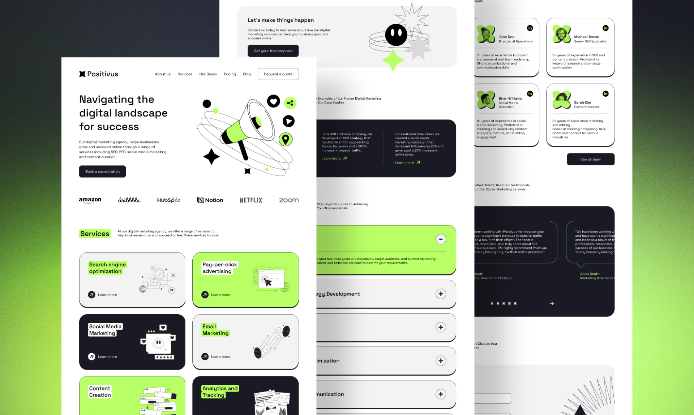

# Positivus - Digital Marketing Agency Landing Page

Introducing "Positivus" - a beautiful and functional landing page design created specifically for digital marketing agencies. With its clean and modern design, Positivus is the perfect template to showcase your agency's services and case studies to potential clients.

Positivus comes complete with two screens - one for desktop and one for mobile - as well as a variety of styles and components, all designed using Figma's auto layout feature for maximum efficiency.

The landing page is divided into sections for easy navigation, including services, case studies, our working process, team, testimonials, contact us, and footer. Whether you're looking to attract new clients or simply update your agency's online presence, Positivus is the perfect solution.

 

## Theme Features

- **Tailwind CSS**: The website is built using Tailwind CSS.
- **Astro.js**: The website is built using Astro.js.
- **Minimalistic Design**: A clean and minimalistic design that focuses on your content.
- **Illustration Based**: Illustrations are used to make the website more engaging.
- **Responsive**: Fully responsive and Mobile-first responsive layout.
- **SEO Friendly**: The website is SEO friendly with canonical URLs and OpenGraph data.
- **Dark Mode**: The website supports dark mode.
- **Markdown & MDX Support**: Write your content in markdown or MDX.

## 🚀 Project Structure

The project is built using Astro.js and Tailwind CSS. Here's a quick look at the project structure:

Astro looks for `.astro` or `.md` files in the `src/pages/` directory. Each page is exposed as a route based on its file name.

There's nothing special about `src/components/`, but that's where we like to put any Astro/React/Vue/Svelte/Preact components.

Any static assets, like images, can be placed in the `public/` directory.

## 🧞 Commands

All commands are run from the root of the project, from a terminal:

| Command                   | Action                                           |
| :------------------------ | :----------------------------------------------- |
| `npm install`             | Installs dependencies                            |
| `npm run dev`             | Starts local dev server at `localhost:4321`      |
| `npm run build`           | Build your production site to `./dist/`          |
| `npm run preview`         | Preview your build locally, before deploying     |
| `npm run astro ...`       | Run CLI commands like `astro add`, `astro check` |
| `npm run astro -- --help` | Get help using the Astro CLI                     |

## 👀 Want to learn more?

Feel free to check [Astro documentation](https://docs.astro.build) or jump into our [Discord server](https://astro.build/chat).

## 📄 License

This project is licensed under the MIT License - see the [LICENSE.md](LICENSE.md) file for details

## 🙏 Acknowledgments

- [Astro](https://astro.build)
- [Tailwindcss](https://tailwindcss.com)

UI/UX Design by [Olga](https://www.figma.com/@olgaaverchenko) and Developed by [Manul Thanura](https://github.com/manulthanura)